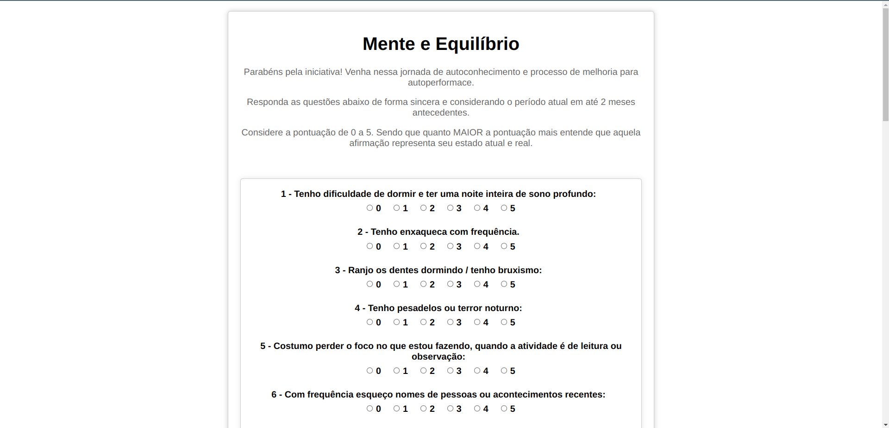
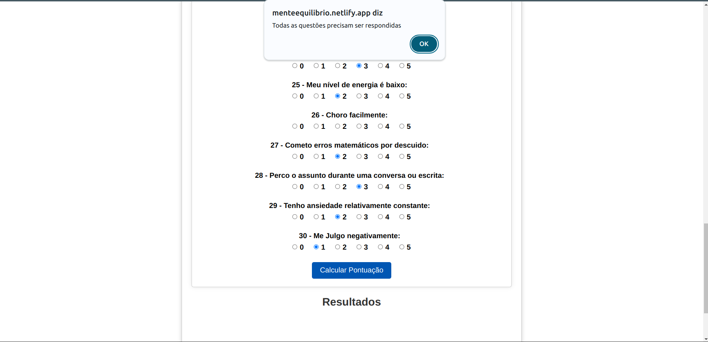
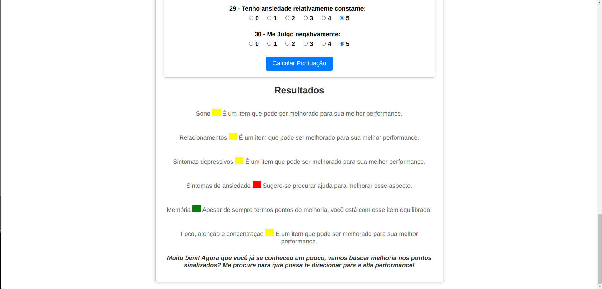

# Teste Mente e Equilíbrio

Este teste é composto por trinta afirmações distribuídas em seis categorias: Sono, Relacionamentos, Sintomas depressivos, Sintomas de ansiedade, Memória e, por fim, Foco, atenção e concentração. 

Cada afirmação permite que o usuário selecione um número inteiro de 0 a 5, indicando o quanto se identifica com a declaração. Quanto mais concordar com a afirmação, maior deve ser o número selecionado. Por outro lado, se discordar da afirmação, menor deve ser o número selecionado.

Ao finalizar o teste, o usuário deverá clicar no botão "Calcular Pontuação" para visualizar o resultado na tela, os resultados são divididos em seis categorias, como mencionado anteriormente. Cada categoria soma o valor das respostas às afirmações correspondentes, variando de 0 a 25. 

Com base na soma das respostas, três mensagens diferentes poderão ser exibidas em cada categoria. 

##### Se a pontuação ficar entre 0 e 10, a mensagem apresentará a categoria seguida de um pequeno retângulo verde e a frase: "Apesar de sempre haver espaço para melhorias, você está equilibrado neste aspecto". 
##### Se a pontuação ficar entre 11 e 20, a mensagem apresentará a categoria seguida de um pequeno retângulo amarelo e a frase: "Há margem para aprimorar seu desempenho nesse item". 
##### E por final, se a pontuação ficar acima de 21, a mensagem apresentará a categoria seguida de um pequeno retângulo vermelho com a frase: "Recomenda-se buscar ajuda para aprimorar este aspecto".

Foi adicionada uma validação para alertar o usuário caso ele não tenha respondido todas as afirmações, exibindo a mensagem na tela: "Por favor, responda a todas as questões".

Link para acessar o teste: https://menteequilibrio.netlify.app/ 

Imagem do início do teste:

Imagem da mensagem de erro:

Imagem do resultado do teste:

